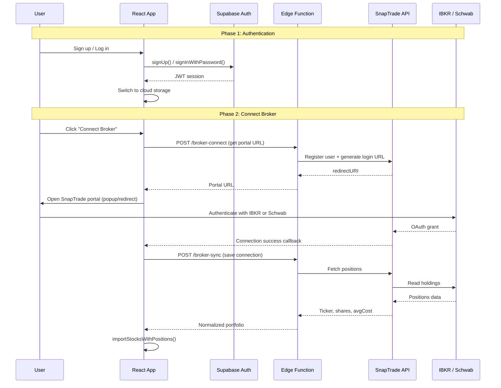

# Auth + Broker Integration

## Architecture



---

## Phase 1: Lightweight Auth

Minimal email/password auth. No guest banners, no migration complexity. Just login/logout with cloud storage.

### 1a. Database Setup

Create a migration for user-specific tables:

```sql
-- portfolios table (replaces localStorage for authed users)
CREATE TABLE portfolios (
  id uuid PRIMARY KEY DEFAULT gen_random_uuid(),
  user_id uuid REFERENCES auth.users NOT NULL,
  ticker text NOT NULL,
  name text,
  shares numeric,
  avg_cost numeric,
  date_added timestamptz DEFAULT now(),
  UNIQUE(user_id, ticker)
);

ALTER TABLE portfolios ENABLE ROW LEVEL SECURITY;
CREATE POLICY "Users see own data" ON portfolios
  FOR ALL USING (auth.uid() = user_id);

-- broker_connections table (stores SnapTrade credentials)
CREATE TABLE broker_connections (
  id uuid PRIMARY KEY DEFAULT gen_random_uuid(),
  user_id uuid REFERENCES auth.users NOT NULL UNIQUE,
  snaptrade_user_id text NOT NULL,
  snaptrade_user_secret text NOT NULL,
  last_synced_at timestamptz,
  created_at timestamptz DEFAULT now()
);

ALTER TABLE broker_connections ENABLE ROW LEVEL SECURITY;
CREATE POLICY "Users see own connections" ON broker_connections
  FOR ALL USING (auth.uid() = user_id);
```

### 1b. Supabase Auth Config

- Enable email/password provider in Supabase Dashboard
- Disable email confirmation for simplicity (instant login after signup)
- Minimum password: 8 characters

### 1c. Auth Context (Frontend)

Create `app/src/lib/auth.ts`:

- Initialize Supabase client (already exists for Edge Function calls)
- `signUp(email, password)`, `signIn(email, password)`, `signOut()`
- `onAuthStateChange()` listener to track session
- Export a React context/hook: `useAuth()` returning `{ user, loading, signIn, signUp, signOut }`

### 1d. Storage Adapter

Create `app/src/lib/cloudStorage.ts`:

- Implements the same interface as current [storage.ts](app/src/lib/storage.ts) but backed by Supabase `portfolios` table
- Key functions: `getPortfolio()`, `saveStock()`, `removeStock()`, `clearAll()`, `importStocksWithPositions()`
- Uses Supabase client with JWT auth (RLS handles per-user isolation)

Update [App.tsx](app/src/App.tsx):

- Check `useAuth()` state
- If logged in: use `cloudStorage` functions
- If guest: use existing `storage.ts` (localStorage) -- no disruption for non-auth users

### 1e. Auth UI

Add `app/src/components/AuthModal.tsx`:

- Simple modal with two tabs: Sign Up / Log In
- Fields: email, password (+ confirm password for signup)
- Error handling for invalid credentials, duplicate email
- On success: close modal, reload portfolio from cloud

Update [App.tsx](app/src/App.tsx) header:

- Guest: show "Log In" button in top-right
- Logged in: show email + "Log Out" dropdown
- No guest banner (keep it minimal)

---

## Phase 2: SnapTrade Broker Integration

### 2a. SnapTrade Account Setup

- Sign up at [snaptrade.com](https://snaptrade.com) for API credentials
- Get `clientId` and `consumerKey`
- Store both as Supabase secrets: `SNAPTRADE_CLIENT_ID`, `SNAPTRADE_CONSUMER_KEY`

### 2b. Edge Function: `broker-connect`

Create `supabase/functions/broker-connect/index.ts`:

Handles three operations (via `action` param):

`**register**` -- First-time setup:

1. Verify JWT (user must be logged in)
2. Call SnapTrade `POST /api/v1/snapTrade/registerUser` with a unique userId
3. Store `snaptrade_user_id` + `snaptrade_user_secret` in `broker_connections` table
4. Call SnapTrade `POST /api/v1/snapTrade/login` to get portal redirect URL
5. Return the redirect URL to frontend

`**portal**` -- Reconnect / add another broker:

1. Look up existing SnapTrade credentials from `broker_connections`
2. Generate new portal URL
3. Return to frontend

`**disconnect**` -- Remove broker connection:

1. Call SnapTrade delete user endpoint
2. Remove from `broker_connections` table

### 2c. Edge Function: `broker-sync`

Create `supabase/functions/broker-sync/index.ts`:

1. Verify JWT
2. Look up SnapTrade credentials from `broker_connections`
3. List connected accounts: `GET /api/v1/accounts`
4. For each account, fetch positions: `GET /api/v1/accounts/{id}/positions`
5. Normalize response to `{ ticker, name, shares, avgCost }[]`
6. Upsert into `portfolios` table (ON CONFLICT update shares/avgCost)
7. Update `last_synced_at` timestamp
8. Return the normalized portfolio + sync stats

### 2d. Frontend: Broker Sync UI

Add broker section to the **Settings** area or a new **"Connect Broker"** button in the header (next to "Add Stocks"):

**Connect flow:**

1. User clicks "Connect Broker"
2. Frontend calls `broker-connect` Edge Function
3. Opens SnapTrade portal in popup window
4. On success callback, calls `broker-sync` to pull holdings
5. Shows results: "Synced 15 positions from Schwab (12 added, 3 updated)"

**Sync flow (hybrid):**

- On app load: check `last_synced_at` -- if >1 hour stale, auto-sync in background
- Manual: "Sync" button with refresh icon + last synced timestamp
- Show a subtle indicator: "Last synced: 2 hours ago" near portfolio header

**Disconnect flow:**

- Settings or account menu: "Disconnect Broker" option
- Confirmation dialog, then calls `broker-connect?action=disconnect`

### 2e. Handle Merged Data

When broker sync returns positions:

- **New tickers** from broker get added to portfolio
- **Existing tickers** get shares/avgCost updated from broker (broker is source of truth for position data)
- **Manual-only tickers** (added by user but not in broker) are kept -- not deleted
- This way users can have a mix of broker-synced and manually-tracked stocks

---

## What stays the same

- All existing features work identically for non-logged-in users (localStorage, no disruption)
- Conviction scoring, AI signals, Trading Signals, Suggested Finds, Market Movers -- untouched
- CSV import still works as an alternative to broker sync

## Files changed/created summary

| File                                         | Action | Purpose                                  |
| -------------------------------------------- | ------ | ---------------------------------------- |
| `supabase/migrations/NNNN_auth_broker.sql`   | Create | portfolios + broker_connections tables   |
| `app/src/lib/auth.ts`                        | Create | Supabase Auth helpers + useAuth hook     |
| `app/src/lib/cloudStorage.ts`                | Create | Cloud-backed storage adapter             |
| `app/src/components/AuthModal.tsx`           | Create | Login/signup modal                       |
| `app/src/components/BrokerConnect.tsx`       | Create | Broker connect/sync UI                   |
| `supabase/functions/broker-connect/index.ts` | Create | SnapTrade register + portal URL          |
| `supabase/functions/broker-sync/index.ts`    | Create | Fetch + normalize positions              |
| `app/src/App.tsx`                            | Modify | Auth state, storage switching, header UI |
| `app/src/lib/storage.ts`                     | Minor  | No changes (stays as guest fallback)     |
