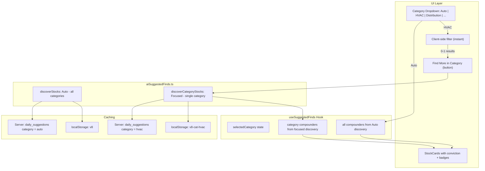

# Enhanced Quiet Compounders: Ranking, Categories, and Focused Discovery

> Cursor agent plan — implemented and shipped

## Overview

Upgrade Quiet Compounders with conviction ranking, valuation/AI badges, industry categories, category dropdown with hybrid filtering + focused re-discovery, and server-side caching per category so results are shared across all users.

## Architecture



## Key Changes

### 1. AI Prompts

**Candidate prompt** — 12 tickers (wider net), AI disruption filter added

**Analysis prompt** — Now returns 3-8 stocks (not fixed 6), with:
- `conviction` (1-10): Buy recommendation strength considering business quality AND current valuation
- `valuationTag`: "Deep Value" | "Undervalued" | "Fair Value" | "Fully Valued"
- `aiImpact`: "Strong Tailwind" | "Tailwind" | "Neutral"
- `category`: Industry classification (e.g., "Industrial Services", "HVAC & Building Services")
- Valuation rules: "A great business at a bad price is not a great buy. P/E must be one of the 3 visible metrics."
- Sorted by conviction descending

**Category-focused prompt** — New `buildCategoryCandidatePrompt(category)` for single-industry discovery

### 2. Industry Categories

```typescript
const COMPOUNDER_CATEGORIES = [
  'Industrial Services', 'Distribution & Logistics', 'Waste Management',
  'Utilities', 'Insurance', 'HVAC & Building Services',
  'Food Distribution', 'Specialty Chemicals', 'Water & Environmental',
] as const;
```

### 3. Category Dropdown (Hybrid Approach)

- **Auto mode (default)**: AI picks best across all industries (3-8 stocks)
- **Category selected**: Instantly filters existing results
- **Sparse results (0-2)**: Shows "Find more in [Category]" button
- **Focused discovery**: Runs compounder pipeline for that single industry, caches per-category

### 4. Server-Side Caching Per Category

**Database migration**: Added `category` column to `daily_suggestions` table with composite unique constraint `(suggestion_date, category)`.

**Edge function**: Updated to accept `?category=` on GET and `body.category` on POST. Default is `'auto'`.

**Cache flow**: `localStorage → Server DB → Generate fresh` (same as Auto, but per category key)

### 5. StockCard UI Enhancements

- **Conviction badge** (top-right): Green (7-10) / amber (4-6) / red (1-3)
- **Category badge**: Industry tag (blue for Compounders, amber for Gold Mines)
- **Valuation pill**: Green for Deep Value/Undervalued, gray for Fair Value, orange for Fully Valued
- **AI impact pill**: Blue for Tailwind, gray for Neutral
- **"Top Pick" label**: First card with conviction >= 8 gets a special indicator

## Files Changed

| File | Changes |
|---|---|
| `app/src/lib/aiSuggestedFinds.ts` | Updated prompts, new category prompt, category discovery function, per-category caching, PROMPT_VERSION 8 |
| `app/src/data/suggestedFinds.ts` | Added `conviction`, `valuationTag`, `aiImpact` to `EnhancedSuggestedStock` |
| `app/src/hooks/useSuggestedFinds.ts` | Category state, `displayedCompounders`, `discoverCategory()` |
| `app/src/components/SuggestedFinds.tsx` | Category dropdown, conviction badge, valuation/AI pills, Top Pick, Find More button |
| `supabase/functions/daily-suggestions/index.ts` | Per-category GET/POST/DELETE support |
| `supabase/migrations/20260208100001_add_category_to_daily_suggestions.sql` | Category column, composite unique constraint |
