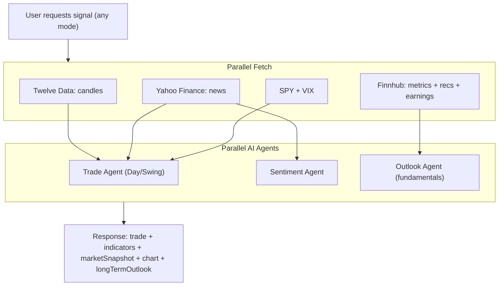

# Long Term Outlook Section

> Cursor agent plan — implemented and shipped

## Overview

Every trade signal (Day, Swing, Auto) gets an additional "Long Term Outlook" section showing whether the stock is fundamentally worth holding. Runs in parallel with the existing trade pipeline — zero added latency.

## Concept

A user searching for a day trade signal on GOOGL might see "Day Trade — Wait" but still want to know: "Is this a good long-term stock?" The Long Term Outlook answers that question using fundamental data, appearing in all modes.

## Architecture



## Backend — Outlook Agent

A lightweight Gemini prompt that runs in parallel with trade + sentiment agents:

- **Always fetches fundamentals** — runs for all modes, not gated by mode selection
- **Data sources**: Finnhub metrics (ROE, P/E, margins, growth), analyst recommendations, recent earnings
- **Output shape**:

```json
{
  "rating": "Strong Buy | Buy | Neutral | Sell | Strong Sell",
  "score": 1-10,
  "summary": "2-3 sentences on why",
  "keyFactors": ["positive or negative factor", "..."]
}
```

- Added to response as `longTermOutlook` field (null if Finnhub key missing)

## Frontend — OutlookSection Component

Rendered after Scenario Analysis in TradingSignals.tsx:

- **Rating badge** — color-coded (Strong Buy = green, Neutral = gray, Sell = red)
- **Score ring** — visual 1-10 score
- **Summary text** — 2-3 sentence assessment
- **Key factors** — listed as pills/chips

Appears for all modes when `longTermOutlook` is present. Gracefully hidden when null.

## Files Changed

| File | Changes |
|---|---|
| `supabase/functions/trading-signals/index.ts` | `fetchFundamentals()` always called, `OUTLOOK_SYSTEM`/`OUTLOOK_USER` prompts, parallel outlook agent, `longTermOutlook` in response |
| `app/src/lib/tradingSignalsApi.ts` | `LongTermOutlook` interface, field added to `TradingSignalsResponse` |
| `app/src/components/TradingSignals.tsx` | `OutlookSection` component with rating badge, score ring, summary, key factors |
