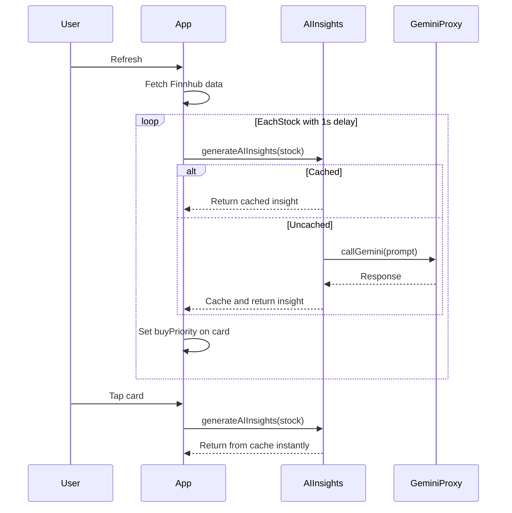

# Remove Batch Processing, Return to Per-Stock AI Calls

## Problem

The batch approach (1 Gemini call for all 19 stocks) causes:

- Main card vs expanded card signal disagreements (two independent AI systems)
- Cascade 429 failures that block ALL stocks when one call fails
- Stale results when batch fails but detail call succeeds

## Approach

Go back to per-stock AI calls. Each stock gets its own Gemini call (cached for 4 hours). The same AI decision is used on the main card AND the expanded card -- no disagreement possible.

To stay within 15 RPM rate limit: stagger calls with a small delay between each stock.

## Changes

### 1. Remove batch infrastructure from `aiInsights.ts`

- Remove `getAICardDecisions`, `_getAICardDecisions`, `batchInFlight` guard, `CardDecision` interface, `getCachedCardDecision`, `cacheCardDecision`, `CARD_CACHE_PREFIX`
- Keep `generateAIInsights` (the per-stock function) as the single source of truth
- Keep the `callGemini` proxy helper and 15s cooldown

### 2. Update `App.tsx` to call per-stock AI

- Remove `import { getAICardDecisions }` and `runAIAnalysis`
- After Finnhub refresh, call `generateAIInsights` for each stock sequentially (with ~1s delay between calls to respect 15 RPM)
- Use the insight's `buyPriority` and `reasoning` to set `stock.buyPriority` and `stock.buyPriorityReasoning` on the main card
- Cached stocks return instantly (no API call), uncached stocks stagger

### 3. Simplify `StockDetail.tsx`

- Remove the batch-decision override logic
- `generateAIInsights` returns from cache instantly (set during the refresh) -- no separate Gemini call needed
- The signal always matches the main card because it's the same cached insight

### Flow after changes

