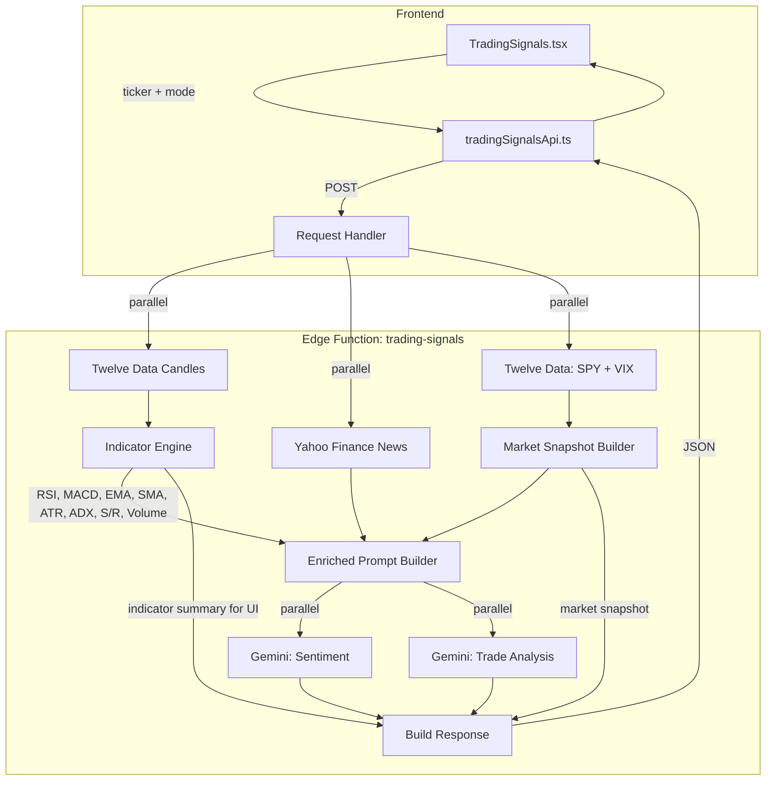

# Trade Signals v2 — Technical Indicators + Enriched AI

> Cursor agent plan — implemented and shipped

## Overview

Enhance the trading signals feature with pre-computed technical indicators (RSI, MACD, EMA/SMA, ATR, ADX), Auto mode detection, enriched AI prompts, richer output (confidence score, dual targets, scenarios), and a market snapshot — all using existing Twelve Data candle data with no new API dependencies.

## Architecture



## Key Changes

### 1. Indicator Engine

New file `supabase/functions/trading-signals/indicators.ts` with pure math functions computed from OHLCV arrays:

- **RSI(14)** — Relative Strength Index (Wilder smoothing)
- **MACD(12,26,9)** — value, signal, histogram
- **EMA(20)** — short-term trend
- **SMA(50)** + **SMA(200)** — medium/long-term trend
- **ATR(14)** — Average True Range (volatility measure)
- **ADX(14)** — Average Directional Index (trend strength)
- **Volume ratio** — current volume vs 20-period average
- **Support/Resistance** — swing high/low detection from recent price action

### 2. Auto Mode Detection

Backend logic in `index.ts`:

- Fetch daily candles first (quick pre-check)
- Compute `atrPercent = ATR(14) / currentPrice`
- Compute ADX from daily candles
- Decision: if `atrPercent > 2%` and high ADX → DAY_TRADE; else → SWING_TRADE
- Response includes `detectedMode` so frontend shows what was chosen

### 3. Market Snapshot

Parallel fetch of SPY + VIX from Twelve Data:

- SPY trend (price vs SMA50), VIX level classification (Low/Moderate/High/Extreme)
- Included in response as `marketSnapshot: { bias, volatility, spyTrend, vix }`

### 4. Enriched AI Prompt

Replace raw candle dump with structured indicator summary:

```
TECHNICAL INDICATORS (pre-computed from candle data):
━━━━━━━━━━━━━━━━━━━━━━━━━━━━━━━━
Momentum:
  RSI(14): 62.3 — bullish, not overbought
  MACD(12,26,9): line 1.24, signal 0.87, histogram +0.37 — bullish crossover

Trend:
  EMA(20): $184.50 — price ABOVE (bullish short-term)
  SMA(50): $178.20 — price ABOVE (bullish medium-term)
  ADX(14): 31.5 — TRENDING (above 25 threshold)

Volatility:
  ATR(14): $3.82 (2.1% of price) — moderate

Key Levels:
  Support: $178.20, $172.50
  Resistance: $192.80, $198.00

Market Context:
  SPY: Bullish (above SMA50) | VIX: 14.2 (Low fear)
```

### 5. Expanded Output Format

- `confidence`: 0-10 numeric scale (was qualitative string)
- `targetPrice2`: Stretch target (was single target)
- `scenarios`: Bullish/neutral/bearish with probability estimates
- `indicators`: Pre-computed values for UI transparency

### 6. Frontend UI

- **Auto mode** as default (Day/Swing become manual overrides)
- **Confidence ring** — visual 0-10 score display
- **Dual targets** — conservative + stretch drawn on chart
- **Scenario cards** — collapsible bullish/neutral/bearish with probability
- **Technical indicators section** — collapsible, showing computed values
- **Market snapshot banner** — "Market: Bullish | Volatility: Low"

## Files Changed

| File | Changes |
|---|---|
| `supabase/functions/trading-signals/indicators.ts` | New — all indicator computation functions |
| `supabase/functions/trading-signals/index.ts` | Auto mode, market snapshot, enriched prompts, expanded output |
| `app/src/lib/tradingSignalsApi.ts` | Updated types for new response format |
| `app/src/components/TradingSignals.tsx` | Auto toggle, confidence ring, scenarios, indicators, market banner |
